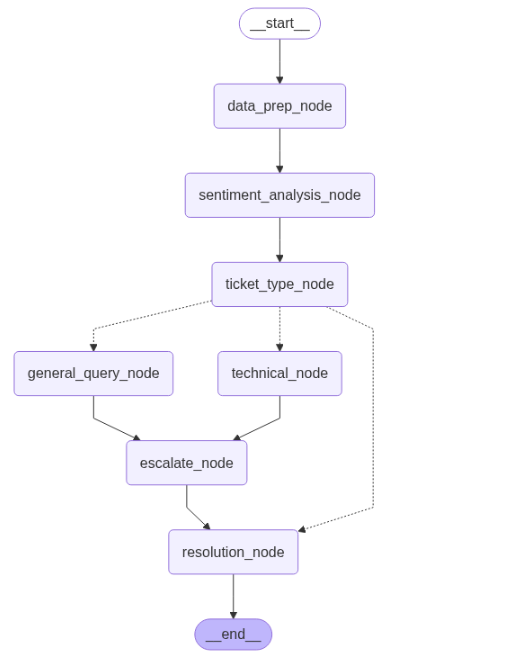

# Customer Support Ticket Resolution Agent

This is a FastAPI-based application powered by LangGraph and Groq's LLaMA3-70B model to automatically analyse customer support tickets, detect sentiment, categorise ticket types, and decide whether a query should be escalated to a human agent.

## Demo Video
Watch the demo video: [Demo Video](https://vimeo.com/1085642391?share=copy#t=0)

---

##  Features

- Preprocesses and extracts query content
- Performs sentiment analysis using LLM
- Classifies ticket type: Technical, Billing & Accounts, or Product/General Inquiry using LLM
- Detects frustration/escalation intent using keywords
- Determines whether to resolve the ticket automatically or escalate to human
- Step-by-step trace of all operations using LangGraph

---
## Process Flow

